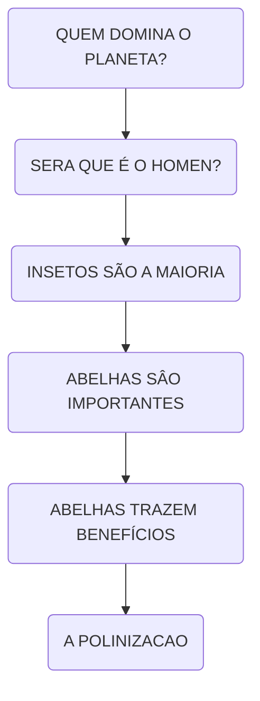
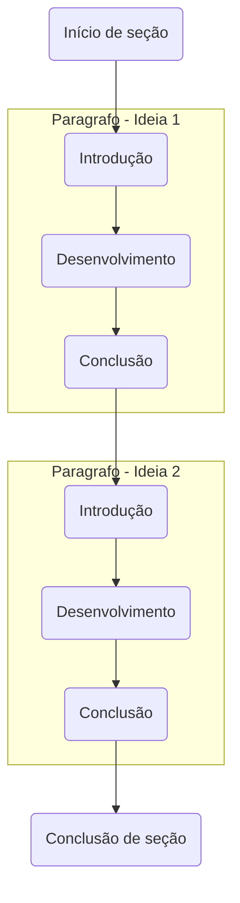

# Rúbrica para portfólios do quinto e sexto período

Este documento tem como principal objetivo orientar os alunos para com observações e pontos importantes que devem ser observados na confecção do `Portfólio Acadêmico` que deverá ser entregue no sexto período.

As dicas citadas neste documento foram criadas com base no modelo disponibilizado pelo Professor Dr. Leonardo; com o objetivo de estruturar da melhor maneira possível o conteúdo do portfólio.

As dicas citadas serão observadas pelos orientadores, Professora Dhebora e Professor Esdras; desta forma forma ficará mais claro para todos os pontos de atenção na escrita assim como um possível padrão de documentação.

Este documento ainda está em evolução e poderá ser atualizado conforme a necessidade; todas as atualizações serão informadas pelo Teams ou em sala de aula.

# DICAS

As dicas abaixo foram definidas com base no modelo existente, quaisquer dúvidas ou sugestoões de melhoria, podem nos solicitar.

## Título

O título é primeiro contato com o leitor com o seu portfólio; ele deve ser simples, completo e geralmente curto, geralmente entre 10 e 20 palavras quando possível.

Observe o exemplo abaixo, nele segmentamos título e subtítulo para melhor entendimento do propósito do projeto.

> Título: Aplicação móvel LINCEU. Subtítulo: Canal de comunicação comunitária destinada às Guardas Municipais

Subtítulos podem complementar o contexto do projeto em si, mas como não foi tipificado no modelo, podemos (não é obrigatório) utilizar abordagem abaixo:

Complemente o título conforme os exemplos abaixo
* "**SYMo: Aplicativo de Gestão Financeira Pessoal**";
* "**Análise e Desenvolvimento de um Aplicativo Móvel para Gestão de Finanças Pessoais: SYMo**";
* "**Aplicativo Móvel SYMo: Estudo de Caso para Desenvolvimento de aplicação para Auxílio à Gestão Financeira Pessoal**"

## Resumo

O resumo é o catão de visitas do seu trabalho acadêmico.  Ele é uma pequena amostra de tudo o que foi desenvolvido. Portanto o resumo deve conter:
1. Introdução de até 2 frases;
2. Objetivo;
3. Materiais e método;
4. Resultados;
5. Discussão e conclusão.

> Não conter parágrafos. Mas calma que já iremos discutir os parágrafos... Como a introdução é um único parágrafo com uma estrutura específica, vamos nos atentar a ele no momento.

> Ser escrito de maneira impessoal e aconselha-se ter entre 200 e 300 palavras para facilitar o entendimento e chamar a atenção e motivar o interesse do leitor.

> Lembre-se, é o resumo que fará o leitor seguir com a leitura de seu trabalho, então capriche! O resumo geralmente é a última parte escrita de seu trabalho, pois neste cenário você já resumiu e revisou praticamente todo o seu trabalho.

## Abstract

O Abstract é a tradução do resumo, também recomenda-se 200 a 300 palavras.

## Palavras-chave

Palavras-chave server para indexação de trabalhos acadêmicos para consulta posterior em repositórios.

> Utilize entre **3** ou **4** e no máximo **6**, quanto menos, mais especifica se torna a busca.  

## Introdução

Introdução é uma revisão de literatura enxuta sugerindo-se entre 400 e 800 palavras utilizando o formato de **CONE INVERTIDO**, mas calma, desta vez entraremos nos assunto dos parágrafos! O objetivo é como sempre, é levar o leitor ao interesse e entendimento do seu portfólio acadêmico.

> A introdução deve mostrar uma retrospectiva do trabalho. Dentre as formas de citação a paráfrase é melhor opção, evitar apud também é uma ótima opção. Na próxima atualização deste documento iremos incluir links para referências estejam centralizadas para simplificar as consultas.

A introdução deve conter em seus parágrafos o passado, o presente e o futuro da pesquisa com os tópicos a seguir:
1. Presente: importancia da pesquisa;
2. Passado: o que já foi feito;
3. Futuro: soluções possíveis concomitando com os objetivos propostos, no portfólio serão omitidos os objetivos.

## Os parágrafos...

Como saímos do resumo que continha um único parágrafo super bem estruturado, vamos dar umas dicas agora de como melhor utilizar os parágrafos na introdução e nos demais segmentos do portfólio.

A linguagem dos trabalhos acadêmicos é extremamente objetiva, ponto!
Não se deve colocar frases subjetivas em seu portfólio. Lembre-se da clareza e objetividade da metodologia cientifica.

Após sua conclusão, seu portfólio será apresentado à sociedade e deverá estar em linguagem **TÉCNICA** e extremamente **OBJETIVA**. 

Mas iremos discutir algumas dicas de como estruturar seus parágrafos de forma técnica e objetiva!

Quando lemos um livro que nos cativa, este é um exemplo maravilhoso de como a boa escrita é  imprescindível.

Algo bem escrito é bem organizado, por ser bem organizado as ideias são apresentadas de maneira que o leitor pode entender o que o escritor está tentando dizer, as ideias estão logicamente interligadas e os detalhamentos são entregues gradativamente. 

Primeiramente temos uma ideia mais abrangente e turva que vai se tornando mais nítida e a cada frase entregue pelo escritor se torna mais específica; consequentemente o leitor embarca na viagem da escrita, passando pelo processo da entrega estruturada do conteúdo da obra entregando o entendimento ao leitor.

### Parágrafo

Parágrafo é um conjunto de frases que, unidas descrevem uma ideia do escritor.

> É o principal objeto de portfólio, cada parágrafo tem o possibilidade de transmitir uma ideia ou conectar outras ideias relacionadas.

Leia este parágrafo...

**Quem domina nosso planeta? Provavelmente a primeira resposta à pergunta seria o homem ou, talvez, os peixes, que estão presentes nos rios lagos, oceanos... Os insetos são mais as abundantes criaturas do nosso planeta... A abelha é um inseto muito comum e é um dos mais importantes seres para o homem; seu grande valor não é apenas por seu produtos: mel, pólen, própolis, geleia real, cera e apitoxia (veneno) mas, principalmente a polinização**.

Este é um exemplo de parágrafo do tipo **CONE INVERTIDO**, note que foram entregues as ideias de maneira global até se chegar à um ponto específico, a polinização de abelhas.

Esta estrutura é uma excelente abordagem para seus parágrafos, o ponto principal para adotar esta maneira de escrita é ter definido as ideias que deverão ser transcritas, inicialmente é confuso e complexo, mas esta estrutura ajudará demais o seu portfólio assim os demais trabalhos acadêmicos que venha a escrever.  

#### Dicas para um bom paragrafo

1. **Introdução**: Inicie seu paragrafo com uma frase principal.
2. **Desenvolvimento**: Coloque ideias secundarias em 2 ou 3 frases que estejam em harmonia com o tópico anterior.
3. **Conclusão**: Elabore o fechamento do tópico.

#### Cone Invertido

#### Parágrafos conectando ideias

Agora que você entendeu a estrutura dos parágrafos `CONE INVERTIDO`, procure estruturar seus parágrafos como um `ALGORITMO` e sua sequência lógica para atingir um objetivo onde, cada parágrafo representaria um `FUNÇÃO` que entrega parte da resolução do algoritmo; como no diagrama abaixo.

## Material e Métodos ou Metodologia

**MÉTODOS, FERRAMENTAS E RELATO DO PROCESSO**, conforme o modelo disponibilizado, todos são sinônimos.

Esta deve ser a parte mais detalhada do seu portfólio, recomenda-se entre 600 e 900 palavras.

Nela deve ser detalhado o material utilizado, o lugar onde se desenvolveu e o método que conduziu o trabalho, como a maioria foram desenvolvimento metodologias agéis como Scrum ou Kanban, seria prudente indicar sempre o método utilizado, geralmente o Scrum; 

**Lembre-se de utilizar sempre os verbos no passado, como por exemplo: utilizou-se, foi conduzido, foi aplicado...**

> Frameworks como Design Thinkinhg utilizados para o processo de criação, caso tenham sido utilizados, seria interessante citar.

### Subtítulos

Recomenda-se o uso de subtítulos para melhorar o entendimento, segmentando as etapas de desenvolviemento do seu trabalho.

## Materiais 

Os materiais utilizados no portfólio em sua grande maioria são softwares e TIC (Tecnologias de Informação e Comunicação)

Então para descrição dos softwares e frameworks utilizados lembre-se da objetividade como no exemplo abaixo, nele o autor citou uma tecnologia utilizada e disponibilizou a referência para o leitor.

**No desenvolvimento deste trabalho, utilizamos o Supabase como plataforma para persistência de dados (Supabase, 2023).

> Lembre-se que você pode incluir outro paragrafo justificando a escolha do **MATERIAL** se julgar necessário, desta forma está implícito que haverá uma referencia para consulta do leitor para maiores informações se aprofundar no conteúdo citado pelo autor,  caso considere necessário. Também podemos considerar que os leitores tenham experiencia previa em leitura de artigos acadêmicos, assim mais um incentivo para a objetividade.

### Métodos

Os métodos devem ser detalhados, mas não excessivamente.

Devemos considerar que pessoas de nossa área poderão entender e repetir os métodos descritos para reprodução dos mesmos resultados, se desejarem repetir os seus métodos.

O meio termo entre o nível de informação para um leigo e uma pessoa de área é complexo no inicialmente, não podemos negar mas cabe a nós o bom censo de não omitir passos detalhados para os leitores de área e não detalhar demais para os leigos, não há uma formula mágica para este equilíbrio então, como o maior expert do portfólio é você, vamos tentar juntos encontrar este equilíbrio, lapidando os excessos e incrementando alguns pontos de melhoria.

Afinal neste ponto seu trabalho já está concluído e estamos tentando melhorá-lo refletindo sobre pontos importantes dos trabalhos acadêmicos. 

> Agora o pulo do gato: Como metodologia ágeis são já não são mais novidade, podemos cita-las brevemente e incluir uma citação ao modelo ágil, desta forma os detalhes estão indicados nas referencias. 
> 

## Resultados

Esta é parte que você deve demonstrar o que obteve com o desenvolvimento de seus projetos no portfólio.

Como os objetivos gerais e específicos foram omitidos para simplificar a estrutura do documento no modelo disponibilizada, exponha os principais benefícios  obtidos.

Recomenda-se entre 400 e 500 palavras no máximo. Você pode incluir imagens, gráficos ou tabelas para reforçar a conclusão e deixá-la mais coesa. 

## Considerações

As considerações finais geralmente é a parte onde ponderamos os resultados e o aprendizado obtido.

Também os inclua passos futuros do projeto, **caso julgue necessário** e seja cabível continuidade e/ou evolução.

> Como não estamos validando hipóteses ou validando resultados para com outras pesquisas, a apresentação de resultados e considerações tem um cunho mais pessoal que acadêmico, então não se prenda nas quantidades de linhas indicadas e  não esqueça da objetividade!

